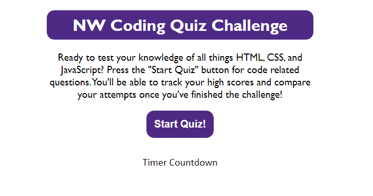

# Northwestern Coding Quiz Challenge!

## Description
Take a time quiz that tests your knowledge of HTML, CSS, and JavaScript!
- When users start the quiz, they will begin the timer countdown as they progress through the questions
- Each question the user gets wrong, will deduct 10s from the timer
- When the user either finishes the quiz before time runs out or the timer counts down to 0, they will progress to the scores page.
- On the scores page, the user will be able to input their initials and save their scores to local storage to track their progress for each time they take the quiz

## Screenshot

## Deployed Link
- 

## Github Link
- https://github.com/iKingSpacely/timed-code-quiz
